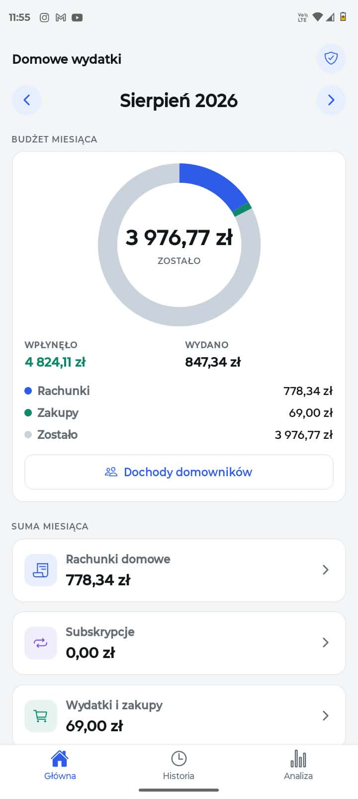
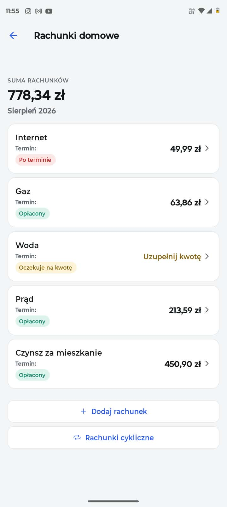
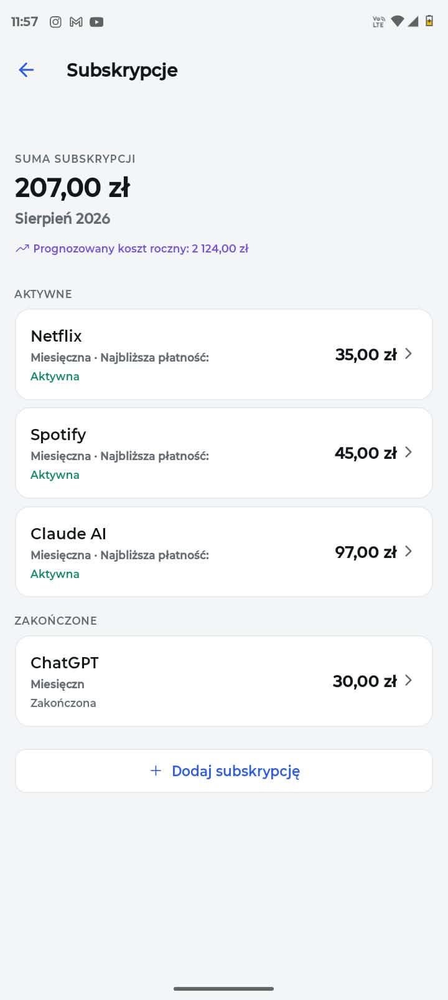

# Domowe wydatki

Aplikacja mobilna na Androida do rejestrowania wydatków domowych: rachunków,
subskrypcji i zakupów. **Działa w całości offline** — bez kont, bez chmury,
bez wysyłania czegokolwiek na zewnątrz. Wszystkie dane leżą w bazie SQLite
na urządzeniu.

Interfejs jest po polsku, kwoty i daty w formacie `pl-PL`.

<p align="center">
  
  
  
</p>

<p align="center">
  <sub>Pozostałe ekrany: <a href="docs/zrzuty/historia.jpg">historia płatności</a> ·
  <a href="docs/zrzuty/zakupy.jpg">zakupy z podziałem na podkategorie</a></sub>
</p>

## Co potrafi

- **Trzy rodzaje wydatków** — rachunki domowe, subskrypcje i zakupy, każdy
  z własną obsługą i podkategoriami.
- **Rachunki cykliczne** — tworzą się same co miesiąc i czekają na wpisanie
  kwoty; historia wcześniejszych kwot jest widoczna przy każdym.
- **Subskrypcje** — miesięczne, kwartalne, roczne i własne, z prognozą kosztu
  rocznego i przypomnieniem o potwierdzeniu, czy nadal się z nich korzysta.
- **Skanowanie paragonów** — odczyt kwoty ze zdjęcia przez ML Kit, offline,
  z obowiązkowym potwierdzeniem przez użytkownika przed zapisem.
- **Budżet miesiąca** — wpisujesz dochody domowników, a wykres pierścieniowy
  pokazuje, ile z nich zostało po odjęciu wydatków.
- **Kopia zapasowa** — eksport całej zawartości do pliku i odtworzenie z niego.

## Uruchomienie

```bash
npm install
npm start
```

Potem `w`, żeby otworzyć wersję webową w przeglądarce, albo zeskanuj kod QR
aplikacją **Expo Go**.

> **Uwaga:** skanowanie paragonów nie zadziała w Expo Go — wymaga modułu
> natywnego, którego tam nie ma. Potrzebna jest własna wersja aplikacji
> (patrz [Budowanie](#budowanie-aplikacji)).

## Stan projektu

Zakończone etapy 0–11: pełne MVP zgodnie ze specyfikacją, plus kopia zapasowa
i budżet miesiąca. Aplikacja jest potwierdzona na fizycznym urządzeniu
z Androidem.

- Postęp prac: [`docs/ETAPY.md`](docs/ETAPY.md)
- Plan dalszy: [`docs/PLAN-DALSZY.md`](docs/PLAN-DALSZY.md)
- Specyfikacja: [`docs/Specyfikacja_aplikacji_wydatki_domowe.pdf`](docs/)

## Technologie

|             |                                             |
| ----------- | ------------------------------------------- |
| Framework   | Expo SDK 54 + React Native 0.81             |
| Nawigacja   | expo-router (trasy z układu plików)         |
| Baza        | SQLite przez `expo-sqlite`, własne migracje |
| Stan danych | TanStack Query                              |
| OCR         | `@react-native-ml-kit/text-recognition`     |
| Wykresy     | `react-native-svg`                          |
| Testy       | Jest — 268 testów                           |

### Dlaczego SDK 54, a nie najnowszy

Expo Go ze sklepów obsługuje SDK 54. Projekt powstał początkowo na SDK 57
i Expo Go odmawiał uruchomienia. Wersja jest przypięta świadomie —
szczegóły i warunki aktualizacji w [`AGENTS.md`](AGENTS.md).

## Architektura

Cztery warstwy, zależności skierowane w jedną stronę. Ekran nigdy nie dotyka
bazy — pyta repozytorium.

| Katalog          | Warstwa      | Zawartość                          |
| ---------------- | ------------ | ---------------------------------- |
| `src/app/`       | Presentation | trasy expo-router, plik = ekran    |
| `src/ui/`        | Presentation | komponenty wspólne, motyw          |
| `src/features/`  | Application  | przypadki użycia, hooki zapytań    |
| `src/domain/`    | Domain       | modele, enumy, reguły biznesowe    |
| `src/data/`      | Data         | SQLite, repozytoria, migracje, OCR |
| `src/lib/`       | —            | kwoty, daty                        |
| `src/constants/` | —            | wszystkie teksty interfejsu        |

Import przez alias `@/` wskazuje na `src/`.

Interfejs `ExpensesRepository` ma dwie implementacje — SQLite i pamięciową —
sprawdzane tym samym zestawem testów kontraktowych. To jest szew, w którym
kiedyś mogłoby stanąć repozytorium chmurowe, bez zmian w ekranach.

## Zasady, których kod nie łamie

- **Kwoty wyłącznie w groszach.** `125,50 zł` to `12550`, nigdy `125.50` —
  arytmetyka zmiennoprzecinkowa gubi grosze przy sumowaniu.
- **Interfejs po polsku, kod po angielsku.** Żadnego polskiego tekstu na
  stałe w komponentach — wszystko przez `src/constants/strings.ts`.
- **Daty jako tekst ISO** `RRRR-MM-DD`, nie obiekty `Date`. Sortują się
  chronologicznie i nie mają strefy czasowej.
- **Migracje, nie kasowanie bazy.** Zmiana schematu to nowa migracja.
- **Żaden ekran nie zawiera SQL.**

Pełna lista wraz z uzasadnieniami: [`AGENTS.md`](AGENTS.md).

## Skrypty

| Polecenie           | Działanie                           |
| ------------------- | ----------------------------------- |
| `npm start`         | Serwer deweloperski Metro           |
| `npm run android`   | Uruchomienie na emulatorze Androida |
| `npm run web`       | Uruchomienie w przeglądarce         |
| `npm test`          | Testy jednostkowe                   |
| `npm run typecheck` | Sprawdzenie typów TypeScript        |
| `npm run lint`      | ESLint                              |
| `npm run format`    | Prettier                            |
| `npm run doctor`    | Kontrola zdrowia projektu Expo      |

Przed zamknięciem etapu uruchamiamy komplet:

```bash
npm run typecheck && npm run lint && npm test
```

## Budowanie aplikacji

Plik APK powstaje w chmurze EAS Build — lokalnie nie jest potrzebne
Android Studio ani Android SDK.

```bash
npx eas login
npx eas build --profile preview --platform android
```

Profil `preview` daje aplikację samodzielną: kod jest w środku, działa bez
komputera i bez internetu. Profil `development` służy do pracy nad kodem
i wymaga uruchomionego `npm start` w tej samej sieci.

> W PowerShell na Windowsie, jeżeli oprogramowanie antywirusowe skanuje ruch
> HTTPS, użyj dołączonego skrótu `.\eas.cmd` zamiast `npx eas` — ustawia on
> Node na korzystanie z magazynu certyfikatów Windows.

## Prywatność

Aplikacja nie ma serwera, nie zbiera analityki i nie wysyła danych nigdzie
poza urządzenie. Rozpoznawanie tekstu z paragonów działa lokalnie. Jedyne
połączenie z siecią zachodzi wtedy, gdy sam udostępniasz plik kopii
zapasowej wybranej przez siebie aplikacji.

## Współtworzenie

Zasady pracy nad projektem: [`CONTRIBUTING.md`](CONTRIBUTING.md).
Zgłaszanie problemów bezpieczeństwa: [`SECURITY.md`](SECURITY.md).

Projekt powstał we współpracy z asystentem AI — plik [`AGENTS.md`](AGENTS.md)
zawiera reguły, których asystent ma przestrzegać, i jest równocześnie
najlepszym wprowadzeniem do decyzji projektowych.

## Licencja

[MIT](LICENSE)
